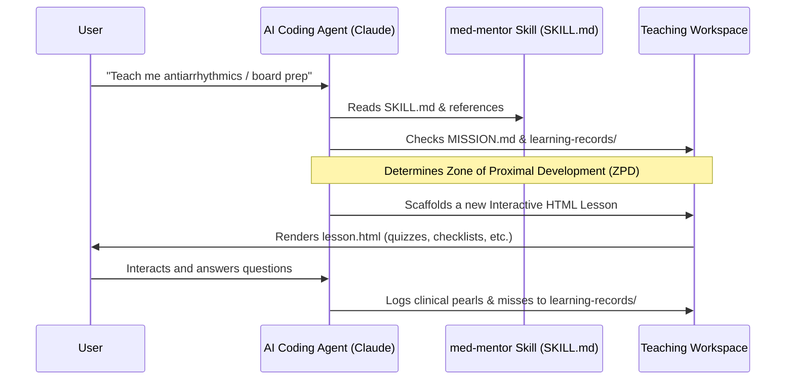

# med-mentor

### A stateful workspace and Claude agent skill for medical education & clinical reasoning

[](https://www.gnu.org/licenses/gpl-3.0)
[](https://github.com/Premansh12/med-mentor/releases)
[](https://skills.sh/)

**med-mentor** is a custom agent skill and structured workspace environment designed for medical students, residents, physicians, nurses, and other healthcare trainees. It enables AI coding agents (like Claude Code or Antigravity) to guide users through structured, stateful clinical lessons, board preparation (USMLE, COMLEX, NCLEX, specialty board exams), and clinical reasoning drills using interactive HTML widgets.

---

## Table of Contents
- [How it Works](#how-it-works)
- [Getting Started](#getting-started)
  - [Installing as an Agent Skill](#1-installing-as-an-agent-skill-recommended)
  - [Initializing the Workspace CLI](#2-initializing-the-workspace-cli-scaffolding-for-all-agents)
- [Features & Capabilities](#features--capabilities)
- [Repository & Workspace Structure](#repository--workspace-structure)
  - [The Skill Repository](#the-skill-repository)
  - [The Teaching Workspace](#the-teaching-workspace-created-locally)
- [Contributing](#contributing)
- [License](#license)

---

## How it Works

The skill structures learning dynamically over multiple sessions. Instead of dumping raw textbook information, the agent guides the user by building interactive lessons (with flashcards, diagnostic calculators, quizzes, and clinical algorithms) custom-fit to the user's knowledge stage.



---

## Getting Started

### 1. Installing as an Agent Skill (Recommended)
To enable your AI agent to dynamically teach you clinical subjects, add this skill to your workspace. The skill is fully compatible with any agent harness supporting workspace configuration directories:
*   **Claude Code** (`.agents/skills/`)
*   **Antigravity & Antigravity CLI** (`.agents/skills/`)
*   **Codex & Codex CLI** (`.codex/skills/`)
*   **OpenCode** (`.opencode/skills/`)
*   **Hermes Agent** (`.hermes/skills/`)
*   **Cline, Roo-Code, Amp, etc.**

Run the following command in your terminal inside your project/study directory:
```bash
npx skills add Premansh12/med-mentor
```
*The `skills` manager will automatically detect your active agent harness and install the skill files in the correct configuration subdirectory.*

### 2. Initializing the Workspace CLI (Scaffolding for All Agents)
If you want to manually initialize a new study directory with the required folders (`lessons/`, `assets/`, `learning-records/`) and templates (`MISSION.md`, `RESOURCES.md`, `NOTES.md`), you can run the CLI script directly from GitHub. This will automatically copy the skill configuration files for **all supported agent harnesses** (Claude Code, Codex, Antigravity, OpenCode, and Hermes Agent) at once:

```bash
npx github:Premansh12/med-mentor
```

---

## Features & Capabilities

### 🎥 Flight Simulator for Clinical Reasoning
Imagine having a personal medical school mentor, board exam coach, and senior attending resident sitting inside your terminal, walking you through patient cases, quizzing you on drug dosages, and grading your diagnostic accuracy—all tailored to your active study goals.

### 🛠️ Interactive HTML Widget Catalog
Lessons aren’t just static text. Agents generate clean, offline-ready HTML interfaces directly in your study folder:
*   **Active-Recall Flashcards**: Double-sided diagnostic cards with interactive click-to-flip functionality.
*   **Clinical Algorithm Flowcharts**: Interactive decision-making trees (e.g., *“Determine next step in suspected Pulmonary Embolism based on Wells Criteria”*).
*   **Interactive Quizzes**: Multiple-choice board prep questions with immediate clinical rationale disclosures.
*   **Dosage & Metric Calculators**: Live calculators to practice patient dosing (e.g., GFR, CHADS₂-VASc score).
*   **Interactive Checklists**: Procedural guides (OSCE preparation) to check off surgical or diagnostic steps.

### 🎨 Tufte-Inspired Editorial Design
Lessons paired with `./assets/styles.css` are designed to look like editorial medical journals (clean typography, zero clutter, phone-friendly layouts) to reduce cognitive load while studying.

### 🔒 Safety-First Medical Sourcing
An integrated safety gate ensures all medical instruction is **high-fidelity and citation-backed**:
*   No fictitious patient data.
*   Mandatory links to primary guidelines (AHA, ACC, DSM-5, etc.).
*   Automatic clinical disclaimer footers built into every lesson.

---

## Repository & Workspace Structure

### The Skill Repository
This repository contains the skill configuration, documentation references for the AI agent, and template formats:
```
med-mentor/
├── bin/
│   └── cli.js                     # CLI execution script (run via npx)
├── formats/
│   ├── MISSION-FORMAT.md          # Template for the user's MISSION.md
│   ├── RESOURCES-FORMAT.md        # Template for the user's RESOURCES.md
│   └── LEARNING-RECORD-FORMAT.md  # Template for session learning records
├── references/
│   ├── learning-design.md         # Educational philosophy and lesson pacing
│   ├── lesson-authoring.md        # Interactive HTML widgets and asset specs
│   ├── mission-and-resources.md   # Guidance on setting up goals and study sources
│   └── safety-and-sourcing.md     # Non-negotiable clinical safety & citation rules
├── SKILL.md                       # Entry point skill definition for agents
└── LICENSE                        # GNU GPL v3 License
```

### The Teaching Workspace (Created Locally)
When the skill runs or is initialized, it builds the following workspace in your current directory:
```
workspace/
├── MISSION.md                     # Why you are studying and what exams you're targetting
├── RESOURCES.md                   # List of verified clinical resources & directories
├── NOTES.md                       # Your personal preferences and study notes
├── lessons/                       # Short, self-contained interactive HTML lessons
├── learning-records/              # Numbered markdown files recording learned pearls and misses
└── assets/                        # Shared CSS, JS quiz engines, and calculators
```

---

## Contributing

We welcome contributions to help improve the med-mentor framework! Whether you are a developer improving the CLI scaffolding or a medical professional writing clinical references/lesson templates:

1. Fork this repository.
2. Create a new branch: `git checkout -b feature/amazing-feature`.
3. If extending medical reference materials under `references/`, make sure they strictly adhere to the guidelines in [references/safety-and-sourcing.md](references/safety-and-sourcing.md) (no real patient data, clear clinical citation).
4. Commit your changes and push: `git commit -m 'Add antiarrhythmic references' && git push origin feature/amazing-feature`.
5. Open a Pull Request.

---

## License

This project is licensed under the terms of the **GNU General Public License v3.0 (GPL-3.0)**. See the [LICENSE](LICENSE) file for the full text.
